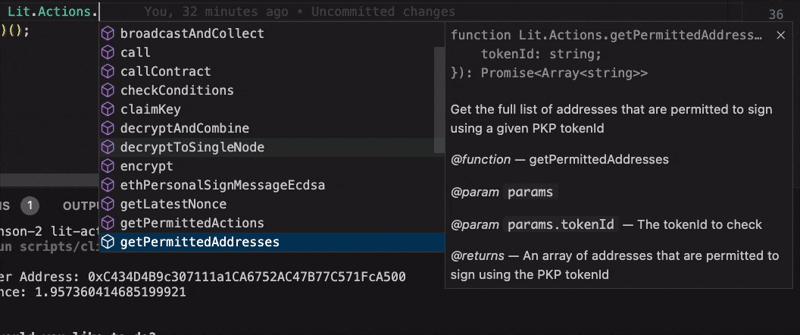

# create-la-app

A development environment for building and testing Lit Protocol Actions. This project provides a structured setup for creating, testing, and deploying Lit Actions with TypeScript support.

## Features

### TypeScript support out of the box for Lit Actions




### CLI for basic setup to run Lit Action


### Built-in Lit Action utilities (more coming soon!)


### Development environment with hot reloading


- Scaffold tools for quick project setup (via `npx create-la-app@latest`)
- Support for multiple networks (datil-dev, datil-test, datil)

## Prerequisites

- [Bun](https://bun.sh) v1.2.2 or higher
- Node.js environment

## Installation

1. Clone the repository:

```bash
npx create-la-app@latest my-la-app
```

2. Install dependencies:

```bash
bun install
```

3. Set up environment variables:

```bash
cp .env.example .env
# Edit .env with your configuration
```

## Project Structure

- `/_config/` - Configuration files (results from the initial setup via the cli)
- `/my-app/` - Application code
- `/my-lit-action/` - Contains Lit Action source code
- `/la-utils/` - Utility functions for Lit Actions
- `/dist/` - Lit Action code string output

## Available Scripts

- `bun run watch` - Start development server with hot reloading (save to trigger to run)
- `bun run start` - Build the Lit Action and run your client app
- `bun run build` - Build the Lit Action
- `bun run cli` - Run the CLI tool

## Development

The project uses Bun as the primary runtime environment. The development server watches for changes in the following directories:

- `./la-utils/`
- `./my-lit-action/`
- `./my-app/`

When changes are detected, it automatically rebuilds and runs the application.

## License

MIT License - see [LICENSE](./LICENSE) for details.

## Contributing

We welcome contributions to improve this project! Just open a new PR!
